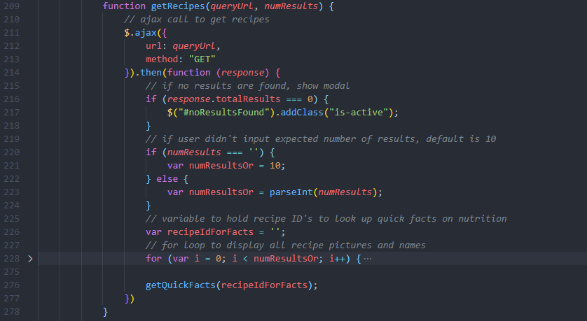
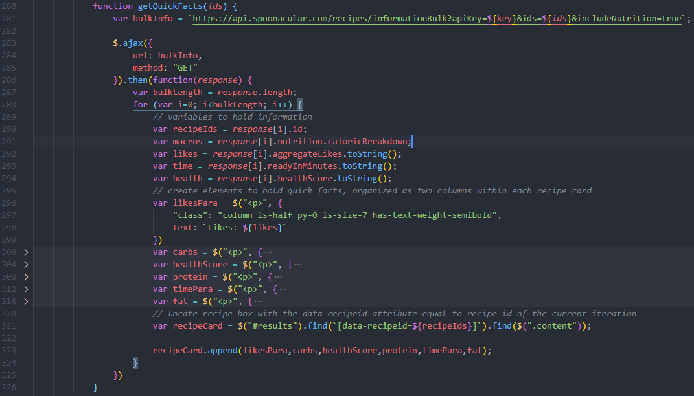
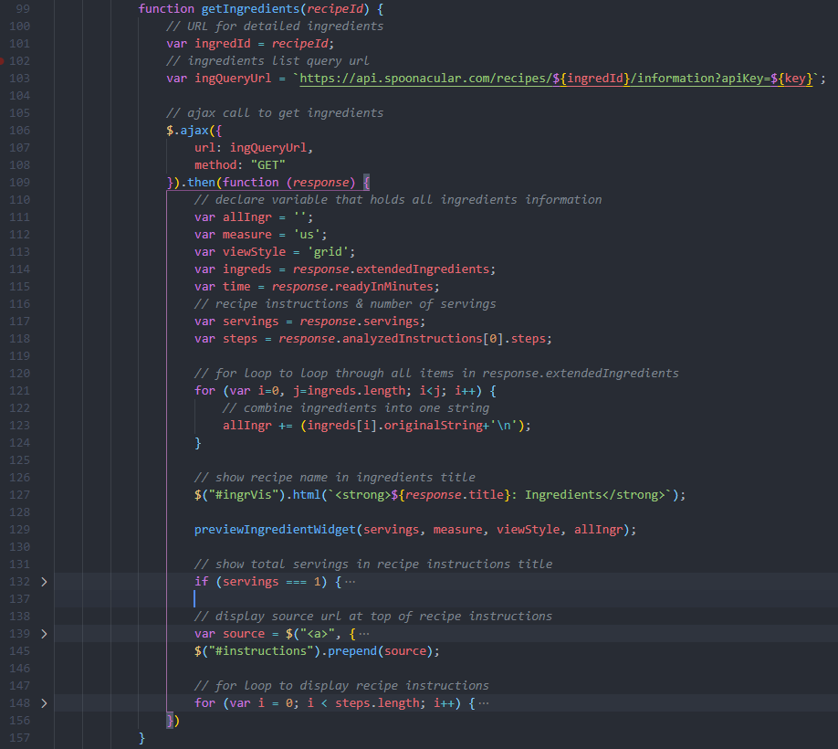
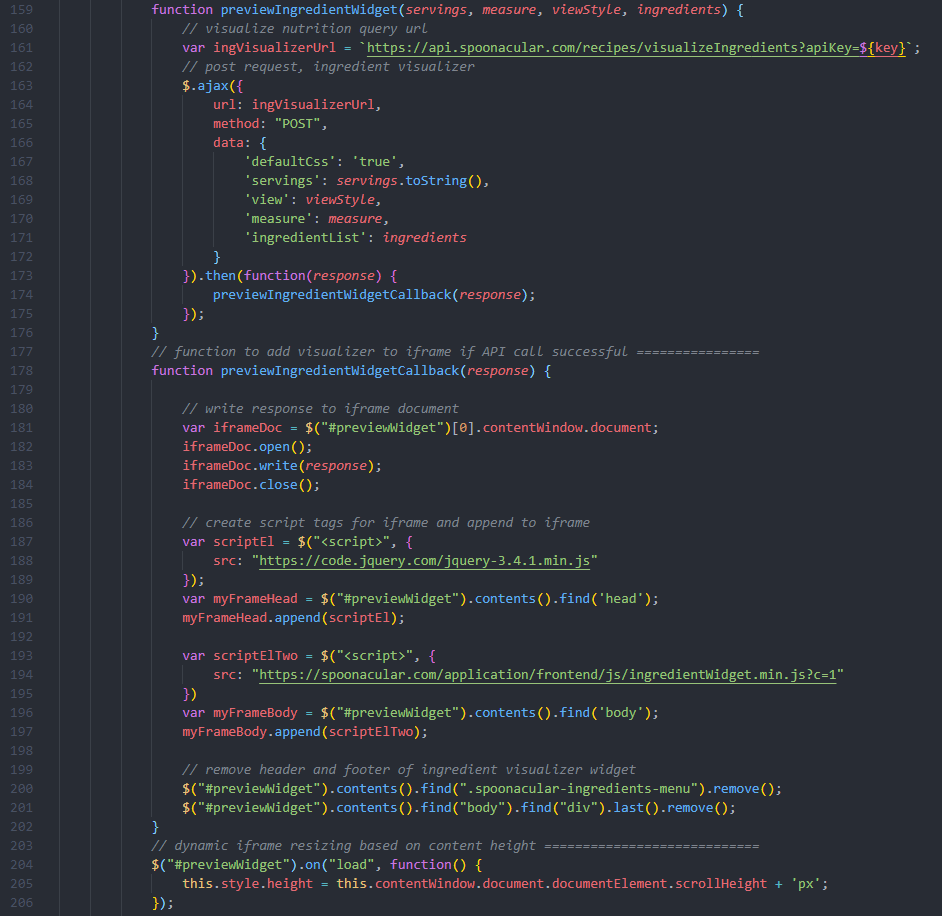
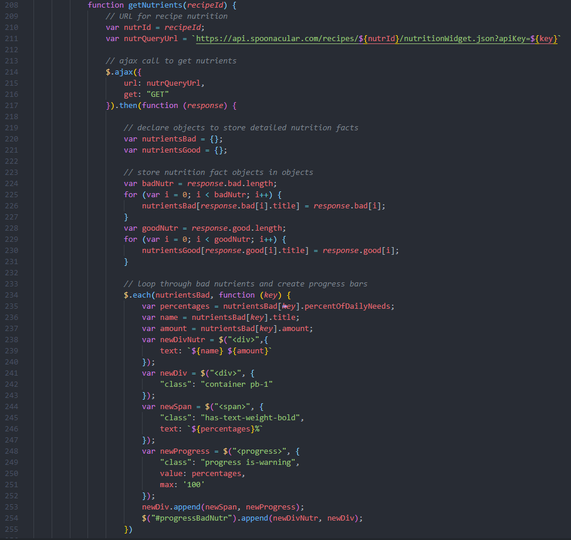

# Food Fix

## Description

Eating healthy and knowing how to cook healthy dishes can be difficult, even boring. We solved that problem and show you that being more health conscious can be simple and delicious.

Rather than wasting time scrolling through Google to find the perfect recipe, our app will present you with dishes that come with their recipe instructions, ingredient list, and nutrituon guide. In addition, our app allows you to choose a diet type, whether you're vegan, gluten-free, vegetarian, etc.; we have something for you! We make it easy for you to find whatever cravings you desire. It's really a one stop shop for anyone interested in cooking healthier meals. 

## User Story
    AS A person interested in health
    I WANT to be able to find any recipe I want with the instructions and nutritional facts 
    SO THAT I don't have to look it up myself

    AS A with a strict diet
    I WANT to be able to find recipes that follow my diet
    SO THAT I have all my options in one place

    AS A person too busy to look up recipes
    I WANT an app that is straightforward and quick to give me recipes 
    SO THAT I don’t need to spend 10+ minutes looking on the internet.

What did you learn?
We learned how to pull information with API keys by using ajax calls. We learned how to brain storm together by coming up with ideas on how to build a useful application. Each of us helped to contribute all of our different ideas which brought a lot of creativity to our website. It was a great experience collaborating with our group members.

## Feautures
This web application consists of: 
 - Search Bar
 - Two drop down buttons for diet type and sorting 
 - Recipe List
 - Recipe Instructions
 - Nutrition Guide
 - Ingredient Images

## Usage

[FoodFix Website](https://kev-luo.github.io/FoodFix/)

The main page contains a few simple search parameters. Only the food parameter is required, all other parameters have default values set so that the user has less to type. If no results are found, a modal pops up and informs the user. If the user does not specify a food, an error message shows up below the food search bar. Results are displayed below the search box, with each recipe containing some quick facts about the nutritional content, recipe popularity, and prep time. The user can click on any recipe they like, which directs them to the next page, which we go into more detail further on in this section.

This is the first API call utilized on the main page. The getRecipes function makes the call and then displays the relevant information based on the specified food and other optional parameters. Each recipe box is provided a data-recipeId attribute. Additionally, this function concatenates all returned recipe ID's to be utilized in the bulk recipe search API below. 

This is the second API call utilized on the main page. Obtaining quick facts for multiple recipes required a different URL. The getQuickFacts function uses the concatenated recipe ID's provided by the getRecipes function to request information for all recipes ID's provided. This function then appends the quick facts to the appropriate recipe box based on each box's data-recipeId attribute. 

The second page contains detailed information about the recipe that the user clicked on. This includes a list of ingredients, preparation instructions, the source URL for the recipe, and a chart showing in-depth nutritional content.

The getIngredients function makes an API call to return the list of ingredients, as well as the recipe instructions. This function displays the recipe instructions, and concatenates all ingredients into one string, which is needed as a parameter to make the API call that returns the pictures of all the ingredients.

The previewIngredientWidget function makes an API call to return Spoonacular's ingredient visualizer widget. This widget is displayed inside an iframe tag, which is dynamically resized depending on the size of the returned content.

The getNutrients function performs the final API call on this page. The response returns two separate arrays: the good nutrients and bad nutrients. Each of these arrays are displayed using Bulma's progress bar components.

## Credits
- [Animate.css](https://animate.style/)
- [Spoonacular](https://spoonacular.com/food-api)
- [Link to Bulma](https://bulma.io/)

## Authors
**Kevin Luo**
- [Github](https://github.com/kev-luo)
- [LinkedIn](www.linkedin.com/in/kevinluo49)

**Kelly Kim** 
- [Github](https://github.com/kellykim831)
- [LinkedIn](https://www.linkedin.com/in/realtorkellykim/)

**Leslie Villatoro**
- [Github](https://github.com/leslievill)
- [LinkedIn](www.linkedin.com/in/leslie-villatoro-a3632a1a3)

## License
This project is licensed under the MIT License 

